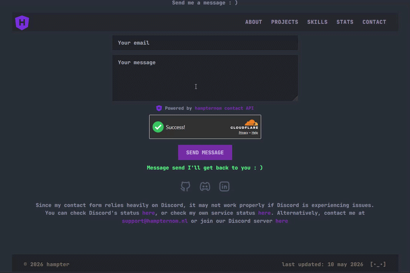

<div align="center">

# contact-api

[](https://nodejs.org/)
[](https://www.typescriptlang.org/)
[](https://expressjs.com/)
[](https://vitest.dev/)
[](https://github.com/Hampter-0/contact-api/blob/main/LICENSE)

**A small, configurable contact form API built with Node.js, Express and TypeScript.**

Takes submissions from your portfolio, validates and protects them,
then forwards them to Discord and/or email, and optionally sends the visitor a confirmation email.

Everything is configured with a `.env` file, and most parts can be switched on or off.



</div>

## features

- Discord webhook notifications
- Email notifications to yourself, with reply-to set to the visitor
- Cloudflare Turnstile (bot protection)
- Rate limiting (default 2 requests per minute per IP)
- Link filter (blocks links and html in name/message)
- Input validation and length limits
- CORS protection
- Confirmation email with an optional signature
- Editable email and message templates
- Configurable form fields, add or remove fields.
- All of it toggleable through `.env`

## tech used

- Node.js + Express 5
- TypeScript
- zod (validation)
- express-rate-limit
- nodemailer
- mustache (templating)
- cors
- dotenv
- vitest (tests)

## setup

### what u need

- [Node.js](https://nodejs.org/) 22.12 or newer
- A package manager: [npm](https://docs.npmjs.com/downloading-and-installing-node-js-and-npm) (comes with Node.js), [pnpm](https://pnpm.io/installation), or [yarn](https://yarnpkg.com/getting-started/install), whichever you prefer
- A Discord webhook URL (and ofcourse a discord server :) ), if you want Discord notifications
- A Cloudflare Turnstile secret key (or turn Turnstile off, see below)
- SMTP details if you want confirmation mails or email notifications
- [Docker](https://docs.docker.com/get-docker/) and [Docker Compose](https://docs.docker.com/compose/install/) if you'd rather run it containerized, see [running with docker](#running-with-docker)

### installation

1. Clone the repo

```
   git clone https://github.com/Hampter-0/contact-api.git
   cd contact-api
```

2. Install dependencies, with whichever package manager you use:

   **npm**
```
   npm install
```

   **pnpm**
```
   pnpm install
```

   **yarn**
```
   yarn install
```

3. Create your `.env` file:

   | | Command |
   |---|---|
   | npm | `npm run setup` |
   | pnpm | `pnpm setup` |
   | yarn | `yarn setup` |

   This copies `.env.example` to `.env` if you don't have one yet (it won't overwrite an existing `.env`).

4. Fill in your `.env` with your real values (Discord webhook, Turnstile key, SMTP details, etc)

5. Start the server

   | | Command |
   |---|---|
   | npm | `npm run dev` |
   | pnpm | `pnpm dev` |
   | yarn | `yarn dev` |

If something in your `.env` is missing or wrong, the server stops on startup and tells you exactly what.

### scripts

Run with `npm run <script>`, `pnpm <script>`, or `yarn <script>`.

| Script | What it does |
|---|---|
| `dev` | run with auto restart (development) |
| `build` | compile TypeScript to `dist/` |
| `start` | run the compiled build (production) |
| `typecheck` | check types without building |
| `test` | run the tests |
| `setup` | copy `.env.example` to `.env` if it doesn't exist yet |

## running with docker

Needs [Docker](https://docs.docker.com/get-docker/) and the [Docker Compose plugin](https://docs.docker.com/compose/install/) (bundled with Docker Desktop, installed separately on most Linux distros).

1. Run `npm run setup` (or copy `.env.example` to `.env` yourself) and fill it in
2. Start the container

```
   docker compose up --build -d
```

By default the container only binds to `127.0.0.1:3001`, so put a reverse proxy (nginx, Caddy, etc) in front of it for real traffic. See the reverse proxy examples below.

### updating

```
git pull
docker compose up --build -d
```

This rebuilds the image with the new code and restarts the container. There's no separate image to pull, the container is built from source.

## configuration

Everything lives in `.env`, see `.env.example` for all options and their defaults.

### feature toggles

Set these to `true` or `false`. Discord and the two email features are fully independent, enable any combination you want.

| Variable | Default | Needs when enabled |
|---|---|---|
| `FEATURE_RATE_LIMIT` | `true` | nothing |
| `FEATURE_TURNSTILE` | `true` | `TURNSTILE_SECRET_KEY` |
| `FEATURE_LINK_FILTER` | `true` | nothing |
| `FEATURE_DISCORD_WEBHOOK` | `true` | `DISCORD_WEBHOOK_URL` |
| `FEATURE_EMAIL_CONFIRMATION` | `false` | SMTP settings (see below) |
| `FEATURE_EMAIL_SIGNATURE` | `true` | nothing (only used if email confirmation is on) |
| `FEATURE_EMAIL_NOTIFICATION` | `false` | SMTP settings (see below), `NOTIFICATION_EMAIL` |

`FEATURE_EMAIL_CONFIRMATION` and `FEATURE_EMAIL_NOTIFICATION` share the same SMTP settings, so those are required if **either** one is turned on:

`SMTP_HOST`, `SMTP_PORT`, `SMTP_USER`, `SMTP_PASS`, `SMTP_FROM`

### other settings

| Variable | Default | What it does |
|---|---|---|
| `PORT` | `3001` | port the server listens on |
| `TRUST_PROXY` | `1` | number of proxies in front of the app |
| `CORS_ORIGINS` | `http://localhost:5173` | allowed origins, comma separated |
| `RATE_LIMIT_WINDOW_SECONDS` | `60` | rate limit window |
| `RATE_LIMIT_MAX` | `2` | max requests per window per IP |

Set `CORS_ORIGINS` to your own frontend domain, or the browser will block the requests.

### confirmation email

Sent to the **visitor** who filled in the form, if `FEATURE_EMAIL_CONFIRMATION=true`.

| Variable | What it does |
|---|---|
| `BRAND_NAME` | name shown as sender and in the signature |
| `EMAIL_SUBJECT` | subject of the mail |
| `EMAIL_BODY` | the message in the mail |

### email notification

Sent to **you** (the site owner), if `FEATURE_EMAIL_NOTIFICATION=true`. This is independent from the confirmation email and from Discord, turn on any combination you like.

| Variable | What it does |
|---|---|
| `NOTIFICATION_EMAIL` | your address, where submissions get sent |
| `NOTIFICATION_EMAIL_SUBJECT` | subject of the notification mail |

The reply-to address is automatically set to whichever submitted field is configured as `type: "email"` in `fields.config.ts` (see below), so hitting reply in your inbox goes straight to the visitor. If no email-type field is configured, the mail still sends, just without a reply-to.

### contact form fields

The fields the form accepts (and validates) are declared in `src/config/fields.config.ts`, not in `.env`. Add, remove, or edit fields there, the validation, link filter, Discord message, and email notification all adjust automatically.

```ts
export const contactFields: ContactFieldOption[] = [
  { key: "name", label: "Name", type: "text", required: true, maxLength: 100 },
  { key: "email", label: "Email", type: "email", required: true, maxLength: 100 },
  { key: "message", label: "Message", type: "textarea", required: true, maxLength: 1000 },
];
```

Each field has:

| Property | Required | What it does |
|---|---|---|
| `key` | yes | internal name, used in the request JSON and everywhere else |
| `label` | yes | human-readable name shown in Discord and email |
| `type` | yes | `text`, `email`, `textarea`, or `select` |
| `required` | yes | whether the field must be filled in |
| `maxLength` | for text/email/textarea | max characters allowed |
| `options` | for `select` only | the allowed values |
| `linkFilterExempt` | no, default `false` | skip the link filter for this field (e.g. a "website" field where links are expected) |

If you add or remove fields here, remember to update your own frontend form to match (same `key` in the JSON body sent to `/contact`).

### email signature

The signature is built from these variables. Everything is optional, leave a value empty and that part is skipped. Set `FEATURE_EMAIL_SIGNATURE=false` to drop the signature completely. Only used in the confirmation email, not the notification email.

| Variable | What it does |
|---|---|
| `SIGNATURE_NAME` | bold black first line, for example your name or team name |
| `SIGNATURE_TITLE` | bold grey line under the name, for example a role |
| `SIGNATURE_TAGLINE` | small italic line, for example `Kind regards,` |
| `SIGNATURE_LOGO_URL` | full url to a logo image |
| `SIGNATURE_LOGO_WIDTH` | logo width in pixels (default `140`) |
| `SIGNATURE_ADDRESS_LINE1` / `SIGNATURE_ADDRESS_LINE2` | address shown in the left column |
| `SIGNATURE_PHONE` | phone number shown in the right column |
| `SIGNATURE_CONTACT_EMAIL` | contact address shown as a mailto link |
| `SIGNATURE_WEBSITE_URL` | website link |
| `SIGNATURE_DISCORD_LINK` | discord invite link |
| `SIGNATURE_FOOTER_NOTE` | small grey note at the very bottom |
| `SIGNATURE_ACCENT_COLOR` | link color (default `#7c3aed`) |

### customizing templates

Nothing about how a message is formatted is hardcoded in TypeScript, it all lives in editable files in `templates/`:

| File | What it is | Used by |
|---|---|---|
| `templates/confirmation-email.html` | the full confirmation email body | visitor confirmation email |
| `templates/signature.html` | just the signature block | confirmation email |
| `templates/discord-message.txt` | the discord message wrapper | discord webhook |
| `templates/notification-email.html` | the notification email body | email notification to you |

All four use [Mustache](https://mustache.github.io/) syntax:

- `{{variable}}` prints a value (escaped, safe for user input)
- `{{{variable}}}` prints raw, unescaped content (only used where the app already built safe html itself, like the signature)
- `{{#variable}}...{{/variable}}` only renders that block when the variable is truthy, used for optional parts (a logo, a tagline) and for looping

`discord-message.txt` and `notification-email.html` both loop over the submitted fields with `{{#fields}}...{{/fields}}`, discord stays plain text/markdown since discord doesn't render html, the notification email is a real html template so you can add images, tables, or any other styling, same as the confirmation email. printing `{{label}}` and `{{value}}` for each one. For example, `discord-message.txt` looks like:

```
**New message**

{{#fields}}
**{{label}}:** {{value}}
{{/fields}}
```

Change `**{{label}}:** {{value}}` to anything you like, drop the bold, change the separator, add extra text ect. The actual list of fields itself still comes from `fields.config.ts`, since that's tied to validation.

To restyle the confirmation email (colors, spacing, layout), edit the `.html` files directly. To change the actual *text* (subjects, body copy, signature name/title/etc), use the `.env` variables instead, that's simpler for day-to-day changes.

> **Note:** if you use VS Code with a Antlers extension installed, it may misinterpret the `{{# }}` Mustache syntax in the `.html` files as its own comment syntax and grey out part of the file. This is a cosmetic editor issue only, it doesn't affect how anything renders. Disable the Antlers extension for this workspace (gear icon next to the extension → "Disable (Workspace)") if it bothers you.

## API

### POST /contact

Validates the message, then sends it to whichever of these are enabled: Discord, an email notification to you, and a confirmation email to the visitor.

Request body:

```json
{
  "name": "hampter",
  "email": "hampter@gmail.com",
  "message": "hi!",
  "turnstileToken": "token from the turnstile widget"
}
```

`turnstileToken` is only needed when `FEATURE_TURNSTILE=true`.

Response:

```json
{
  "success": true
}
```

Errors come back as `{ "error": "..." }`:

| Status | When |
|---|---|
| `400` | invalid input, links in the message, or failed Turnstile check |
| `429` | too many requests |
| `500` | something broke on the server |

## frontend example

A minimal HTML form that posts to `/contact`, including the Turnstile widget:

```html
<!DOCTYPE html>
<html lang="en">
<head>
  <meta charset="UTF-8" />
  <title>Contact</title>
  <script src="https://challenges.cloudflare.com/turnstile/v0/api.js" async defer></script>
</head>
<body>
  <form id="contact-form">
    <input type="text" name="name" placeholder="Name" required />
    <input type="email" name="email" placeholder="Email" required />
    <textarea name="message" placeholder="Message" required></textarea>

    <!-- replace with your own Turnstile site key -->
    <div class="cf-turnstile" data-sitekey="YOUR_TURNSTILE_SITE_KEY"></div>

    <button type="submit">Send</button>
  </form>

  <p id="status"></p>

  <script>
    const form = document.getElementById("contact-form");
    const status = document.getElementById("status");

    form.addEventListener("submit", async (event) => {
      event.preventDefault();

      const formData = new FormData(form);
      const payload = {
        name: formData.get("name"),
        email: formData.get("email"),
        message: formData.get("message"),
        turnstileToken: formData.get("cf-turnstile-response"),
      };

      status.textContent = "Sending...";

      try {
        const response = await fetch("https://api.myportfolio.com/contact", {
          method: "POST",
          headers: { "Content-Type": "application/json" },
          body: JSON.stringify(payload),
        });

        const data = await response.json();

        if (response.ok) {
          status.textContent = "Message sent!";
          form.reset();
        } else {
          status.textContent = data.error || "Something went wrong.";
        }
      } catch (err) {
        status.textContent = "Could not reach the server.";
      }
    });
  </script>
</body>
</html>
```

Replace `https://api.myportfolio.com/contact` with your own API URL, and the Turnstile site key with your own.

## project structure

```
src/
├── config/        env parsing, constants, feature fields, and the config object
├── lib/           small helpers (errors, logger, html escape, fields list builder)
├── middleware/    cors, rate limit, error handling
├── modules/
│   └── contact/   filters, schema, service, controller, routes
├── services/      turnstile, discord and mail
├── app.ts         builds the express app
└── server.ts      starts the server
templates/         editable html/text templates (mustache)
tests/             vitest tests
```

## example reverse proxy configs

### Nginx

```
location /contact {
    # Replace 'localhost:3001' with the host and port where your Node.js app runs
    # For example, if your app runs on port 4000: proxy_pass http://localhost:4000/contact;
    # Keep the '/contact' at the end if your Node route is /contact
    proxy_pass http://localhost:3001/contact;
    # Standard headers for websockets and reverse proxy
    proxy_http_version 1.1;
    proxy_set_header Upgrade $http_upgrade;
    proxy_set_header Connection 'upgrade';
    proxy_set_header Host $host;
    proxy_cache_bypass $http_upgrade;
    # Needed so rate limiting sees the real visitor ip
    proxy_set_header X-Forwarded-For $proxy_add_x_forwarded_for;
    proxy_set_header X-Forwarded-Proto $scheme;
}
```

Optional HTTPS with Lets Encrypt:

```
sudo certbot --nginx -d api.myportfolio.com
```

### Apache

```
<VirtualHost *:443>
    # Replace with your real domain
    ServerName api.myportfolio.com
    ServerAdmin webmaster@localhost

    # Enable SSL
    SSLEngine on
    # Replace these paths with your SSL certificate and key if using https
    SSLCertificateFile /etc/letsencrypt/live/api.myportfolio.com/fullchain.pem
    SSLCertificateKeyFile /etc/letsencrypt/live/api.myportfolio.com/privkey.pem

    ProxyPreserveHost On
    ProxyRequests Off

    # Proxy /contact route to Node.js backend
    # Replace 'localhost:3001' if your Node app runs on another port
    ProxyPass /contact http://localhost:3001/contact
    ProxyPassReverse /contact http://localhost:3001/contact

    ErrorLog ${APACHE_LOG_DIR}/api-ssl-error.log
    CustomLog ${APACHE_LOG_DIR}/api-ssl-access.log combined
</VirtualHost>
```

For apache also enable the modules:

```
sudo a2enmod proxy proxy_http ssl
sudo systemctl restart apache2
```

If you run the app with no reverse proxy in front of it, set `TRUST_PROXY=0`.

## license

MIT